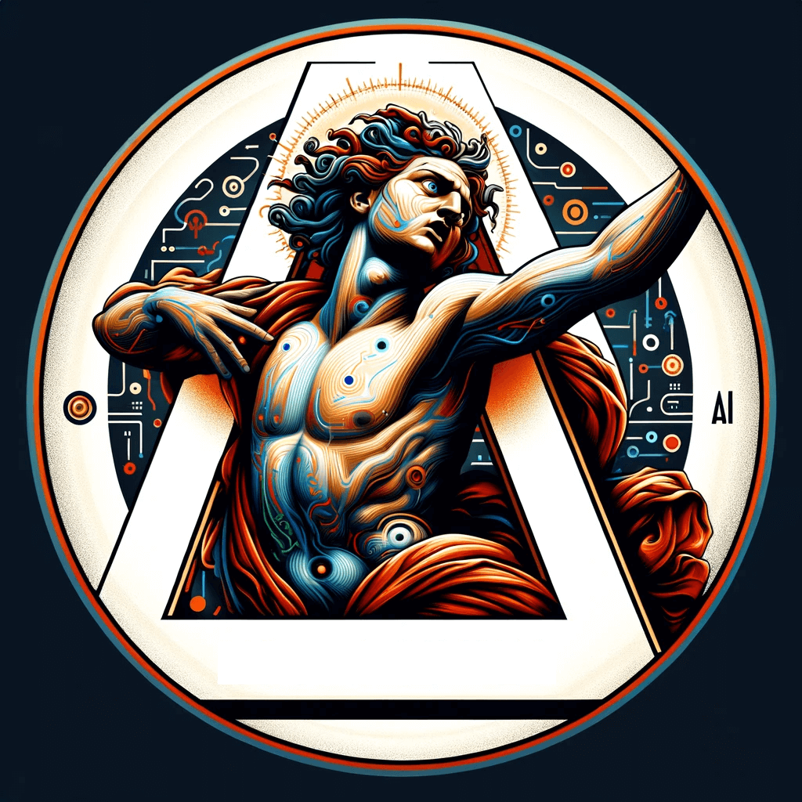

## CARAVARVEL-AI

Caravarvel-AI (Caravaggio + Marvel + AI) is a personal project that uses [Marvel&#39;s Developer API ]("https://developer.marvel.com/) to retrieve data about their events (like sagas) and uses their descriptions to get [Dall-E](https://openai.com/dall-e-3) to create Caravaggio style paintings.

The frontend is done in NextJS 14.